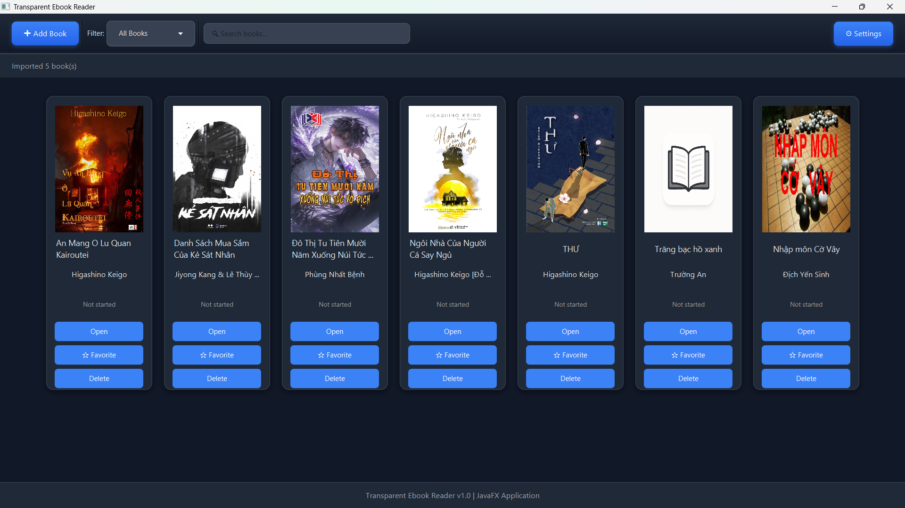
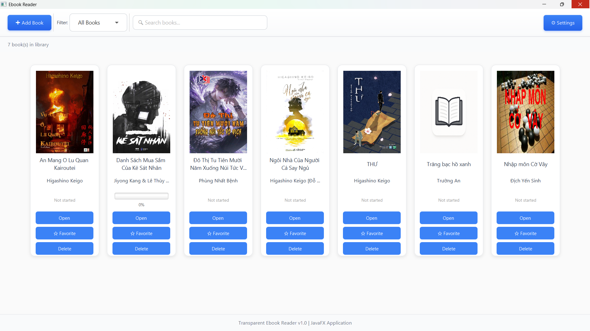
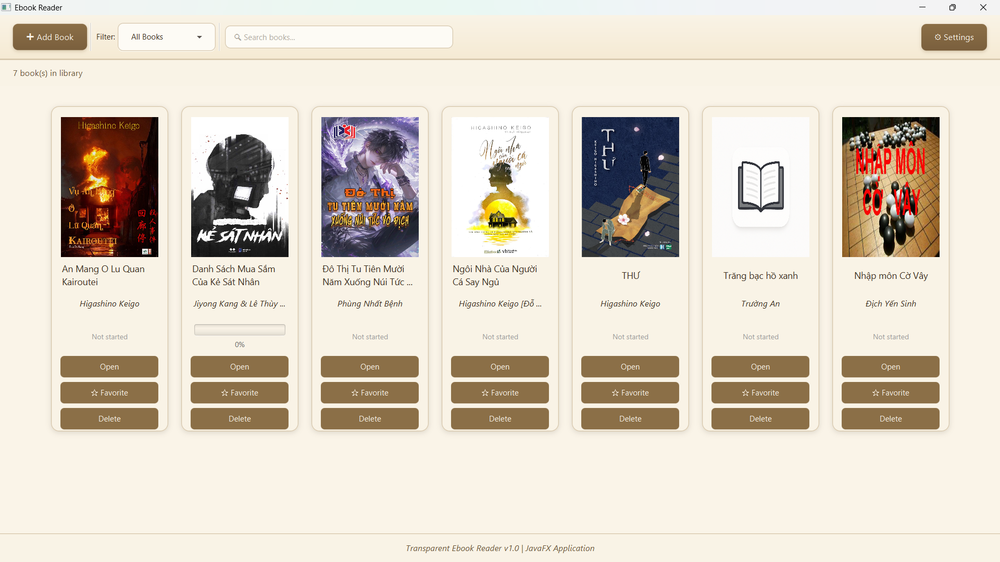
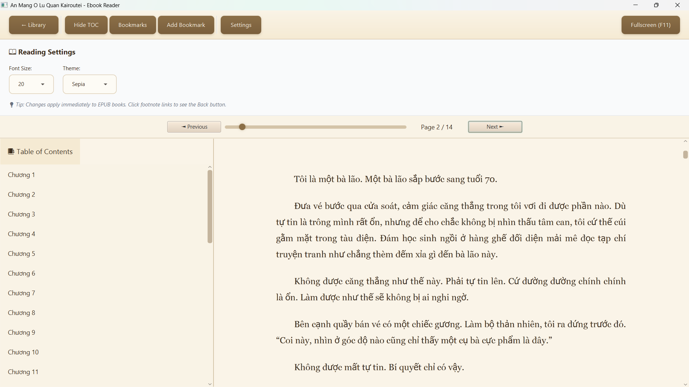

# 📚 Transparent Ebook Reader






A modern, feature-rich desktop ebook reader built with JavaFX.  

---

## 🚀 Installation

### **Prerequisites**
- Windows 

---

## **✨ Features (Updated 2025)**
### 📖 Reading

- Smooth EPUB rendering (WebView-based)
- Optimized PDF rendering (PDFBox 3.0)
- Auto-save reading progress (scroll position / page)
- Fullscreen mode (F11)
- Next/previous page navigation
- Fast PDF page loading (improved caching)

### 🎨 Themes & UI

-3 themes: Light / Dark / Sepia
- Adjustable font size
- Custom embedded fonts for a beautiful reading experience
- Modern UI (Inter/SF-inspired)

### 📚 Book Management

- Import multiple EPUB/PDF at once
- Automatic metadata extraction (title, author)
- Book thumbnails
- Favorite marking (❤️)
- Reading history saved automatically

### 🔧 Settings

- Choose theme
- Change font size
- Saved instantly without restart

### 🗂️ Data

- Local SQLite database
- Stores: Books, Favorites, Reading Progress, Settings

### 💾 Portable Runtime Bundled

- Works on ANY Windows machine
- No Java required
- Just unzip → run EbookReader.exe


# 💻 Usage

## **Adding Books**
- Click **Add Book**
- Select one or multiple EPUB/PDF files
- Books are automatically imported with metadata

---

## **Reading**
- Click any book to open  
- Use ← / → or Page Up / Page Down  
- Press **F11** for fullscreen  
- Press **ESC** to exit fullscreen  

---

## **Keyboard Shortcuts**

| Key | Action |
|-----|--------|
| ← / → | Previous / Next page |
| Page Up / Page Down | Scroll pages |
| Ctrl + B | Add bookmark |
| F11 | Toggle fullscreen |
| ESC | Back / Exit |

---

## **Customizing Settings**
- Click **Settings**
- Choose theme: Light / Dark / Sepia  
- Adjust font size, custom fonts
- Changes apply instantly  

---

# 🛠️ Building from Source

### **Prerequisites**
- JDK 17+
- Maven 3.8+
- Git

---

### **Clone Repository**
```bash
git clone https://github.com/yourusername/transparent-ebook-reader.git
cd transparent-ebook-reader
```

---

### **Build with Maven**
```bash
mvn clean javafx:run
```

### **Package JAR**
```bash
mvn clean package
```

### **Create Windows installer (JPackage)**
```bash
mvn clean install
```

---

# 📂 Project Structure

```
ebook-reader/
├── src/
│   ├── main/
│   │   ├── java/com/ebook/reader/
│   │   │   ├── controller/
│   │   │   ├── dao/
│   │   │   ├── model/
│   │   │   ├── service/
│   │   │   └── Main.java
│   │   └── resources/
│   │       ├── css/
│   │       ├── fxml/
│   │       └── images/
├── pom.xml
└── README.md
```

---

# 🏗️ Technology Stack

### **Core**
- Java 17  
- JavaFX 21  
- Maven  

### **Libraries**
- Apache PDFBox 3.0  
- SQLite JDBC  
- SLF4J  

### **Architecture**
- MVC Pattern  
- DAO Pattern  
- Observer Pattern  

---


# 🤝 Contributing

### **Steps**
```bash
git checkout -b feature/AmazingFeature
git commit -m "Add AmazingFeature"
git push origin feature/AmazingFeature
```

Open a Pull Request on GitHub.

---

# 🐛 Known Issues
- Large PDFs (>500 pages) may load slowly  
- Some EPUB SVGs render incorrectly  
- Heavy usage may require more RAM  

---

# 📄 License (MIT)

```
MIT License  
Copyright (c) 2025
```

---

# 📞 Contact

**Author:** Hashi  
**Email:** phamthithienha17032005@gmail.com  
**GitHub:** https://github.com/hashi173

---

Thanks for using Transparent Ebook Reader! ❤️
